# RAG implementation: code walkthrough aur interview preparation

## Pehle poori picture

RAG = Retrieval-Augmented Generation. Hum model ko train nahi kar rahe; hum question ke relevant PDF passages dhoondhkar model ko answer ke saath evidence dete hain.

Do alag flows hain:

```mermaid
flowchart LR
  Upload[PDF upload] --> Validate[Validate size, PDF, quota, duplicate]
  Validate --> Storage[Private S3 / MinIO]
  Storage --> Queue[Postgres queued document]
  Queue --> Beat[Celery beat dispatcher]
  Beat --> Worker[Celery worker]
  Worker --> Parse[Page text]
  Parse --> Chunk[Page-aware chunks]
  Chunk --> Embed[Ollama embeddings]
  Embed --> DB[pgvector + ready status]
```




Example: PDF page 4 says "Employees receive 20 days of annual leave." User asks "Kitni leaves milengi?" Query vector finds that chunk. Backend labels it S1. Model answers "20 days [S1]." Backend resolves S1 to real document ID, page 4 and original excerpt. Frontend opens the authenticated PDF at page 4.

## Kaunsa program kya karta hai?

Paths below are relative to `backend/`.

| File | Responsibility | Interview explanation |
| --- | --- | --- |
| `app/core/config.py` | Model, 1024 dimensions, batch size, quota, threshold, feature flag | API aur worker ko same configuration chahiye. |
| `app/api/routes/documents.py` | Authenticated list/upload/file/retry/delete APIs | Route thin hai; business rules service mein hain. |
| `app/schemas/document.py` | Frontend response contract | Pydantic response validation aur serialization karta hai. |
| `app/repositories/document_repository.py` | Owner-scoped reads and row locks | User ID session se aata hai, request body se nahi. |
| `app/services/document_service.py` | Bounded read, SHA-256 dedupe, quotas, private key, retry/delete | Same user ki concurrent uploads account row lock se serialize hoti hain. |
| `app/services/storage/s3_service.py` | Private PDF put/get/delete | Blocking boto3 calls `asyncio.to_thread` mein jaati hain; event loop block nahi hota. |
| `app/services/ingestion/pdf_parser.py` | Real PDF parsing, encryption/page/text limits | Tumhare parser ka page-numbered output preserve kiya hai. CPU/memory/wall-time isolation add ki hai. |
| `app/services/ingestion/chunker.py` | 1800-character windows, 250-character overlap | Chunk page boundary cross nahi karta, isliye citation page accurate rehta hai. |
| `app/services/llm/embedding_service.py` | `/api/embed`, query instruction, digest and vector validation | Passage aur query same model/vector space mein hone chahiye. |
| `app/workers/celery_app.py` | Broker configuration, task imports, 15-second schedule | Worker executes; beat schedules. Dono processes chahiye. |
| `app/workers/tasks/index_document.py` | Dispatch, atomic job claim, parse, chunk, embed, publish | Duplicate delivery safe hai; final transaction token/version check karti hai. |
| `app/db/models/document.py` | Document metadata and vector chunks | Original PDF S3 mein; searchable text + vectors PostgreSQL mein. |
| `app/services/retrieval/retrieval_service.py` | Authorize all selected documents, exact cosine query | Ownership filter top-k se pehle SQL mein lagta hai. |
| `app/services/retrieval/rag_service.py` | Follow-up context, evidence prompt, labels and validation | Model source IDs/pages invent nahi karta; backend source map own karta hai. |
| `app/services/conversation_service.py` | Prepare turn, generation, finalize/cancel/error | RAG answer buffer hota hai; validation + DB commit ke baad content/citations/done emit hote hain. General chat streams normally. |
| `app/repositories/chat_repository.py` | Transactional message and citation persistence | Answer aur citation snapshot same commit mein save hote hain. |
| `app/schemas/conversation.py` | RAG options and citation response | Enabled mode mein 1–20 distinct document UUIDs required. |
| `migrations/versions/0003_document_rag.py` | Enable vector extension and create document tables | Python pgvector package aur PostgreSQL extension different cheezein hain. |
| `migrations/versions/0004_citation_snapshots.py` | Add JSONB citations to messages | PDF delete hone par historical excerpt preserve hota hai. |

Frontend: `src/app/documents/page.tsx` uploads and polls status; `RagControls.tsx` selects ready PDFs; `CitationList.tsx` shows server-provided snapshots; `PdfPreview.tsx` fetches authenticated PDF bytes; `chat-stream.ts` handles content/citations/done events. Existing frontend contracts remain compatible.

## Important decisions, reason ke saath

**Why chunk?** Entire PDFs model context mein expensive aur noisy hain. Small relevant passages answer ko focused banate hain. Current splitter characters use karta hai, tokens nahi; sentence/table layout flatten ho sakta hai.

**Why overlap?** Chunk edge par important context lose na ho. Overlap 250 ek initial tuning choice hai; larger overlap means more embeddings and repeated evidence.

**Why a separate embedding model?** Embedding model search ke liye vectors banata hai. Chat model evidence se readable answer banata hai. Groq chat use karne par selected passages Groq ko jaate hain; embeddings configured Ollama par rehte hain. All-local answering ke liye Ollama chat select karo.

**Why digest, not just model name?** Same tag ke weights change ho sakte hain. Ingestion records digest; retrieval rejects mismatching model/digest/processing version. 1024 dimensions match hona alone enough nahi hai. Model upgrade ke baad existing PDFs delete/re-upload karne honge; seamless reindexing is not implemented.

**What is cosine distance?** Vector directions ki dissimilarity. Lower is closer. `1 - distance` similarity hai, confidence/probability nahi. Current exact search returns at most six rows with distance <= `RAG_MAX_DISTANCE` (default 0.65). Yeh threshold calibrated guarantee nahi hai: apne questions par evaluate karo.

**What if nothing matches?** Model call skip hota hai. Saved reply: "I couldn't find that in the selected PDFs." General knowledge fallback nahi hota.

**How do follow-ups work?** Previous two user questions, bounded to 1500 characters each, augment the retrieval query. Latest retrieval question is bounded to 5000 characters. Original question history mein unchanged save hota hai. Yeh simple heuristic hai, full standalone-query rewrite nahi.

**Can a PDF prompt-inject the model?** Prompt evidence ko untrusted data declare karta hai, instructions follow karne se mana karta hai. Source map/label validation fabricated source metadata block karti hai. Prompt alone semantic correctness ya injection immunity prove nahi karta; claim-support evaluation abhi needed hai.

**Does a valid citation prove the answer?** Nahi. `[S1]` valid source refer karta hai, lekin model us source ko misinterpret kar sakta hai. Current checker label existence and citation presence verify karta hai, every claim ka entailment nahi.

**Why buffer RAG responses?** Streaming fabricated labels show kar sakti hai before validation. RAG response only successful validation and persistence ke baad show hota hai. Tradeoff: time-to-first-answer slower. Stop/disconnect par generated partial text `interrupted` status se save hota hai, only known source snapshots ke saath.

**How is Redis failure handled?** `queued` document row durable job intent hai. Beat dispatches every 15 seconds. Publish fail hua to row stays queued; next dispatch tries again. No commit-before-publish gap can lose the durable intent. Yeh document-table-backed queue hai, separate outbox table nahi.

**Why job token and lease?** Celery may deliver twice. Worker locks row, claims random token and 20-minute lease. A duplicate sees active lease and exits. Task hard limit 15 minutes hai. Dead worker ka expired lease dispatcher redeliver karta hai. Old worker's final write needs matching token/version; otherwise ignored.

**What about deletion during indexing?** Delete and finalization share row locks. Delete removes original then row; FK cascade removes chunks. Worker cannot recreate missing row or publish against obsolete token/version. Old chat citation JSON remains readable.

**Are PostgreSQL and S3 transactional together?** Nahi. Normal DB write failure par uploaded object clean up hota hai. Process crash between S3 put and DB commit can leave an orphan object; production reconciliation is still needed. Storage-delete success followed by DB failure also needs retry/reconciliation. No distributed transaction is claimed.

**Why no automatic OCR?** pypdf text extractor hai. Any page with fewer than 30 non-whitespace-edge characters triggers `needs_ocr`, including blank pages conservatively. OCR engine and mixed-page image detection are future work. Upload validation parses in a limited child process; worker repeats extraction after reading the stored original.

## Run it locally

Existing `.env` credentials preserve karo. PostgreSQL needs pgvector binaries; the migration enables the extension. Configured S3 bucket must already exist and be private. Ollama must have `qwen3-embedding:0.6b`.

From `backend/`, in your activated environment:

```bash
alembic upgrade head
celery -A app.workers.celery_app:celery_app worker --loglevel=INFO --concurrency=1
```

Separate terminal, same environment:

```bash
celery -A app.workers.celery_app:celery_app beat --loglevel=INFO --schedule=/tmp/documentar-celerybeat
```

Then set `RAG_ENABLED=true` in your backend environment and restart the API. Start it with `uvicorn main:app --reload`. Both API and worker need matching database, S3, Redis, Ollama and embedding settings. Compose now includes worker and scheduler services; run only one scheduler. In Compose, also set `RAG_ENABLED=true` in `deployement/.env`. Production still requires the existing one-off migration step.

Open Documents → upload PDF → wait for Ready → Chat → Answer from my documents → select PDF → ask → inspect citation → open page → reload chat. A browser smoke remains necessary to verify that your PDF viewer honors `#page=`.

## Verification commands

```bash
# Unit suite; DB integration tests require TEST_DATABASE_URL
pytest -q

# Creates a uniquely named temporary DB, migrates, checks schema drift,
# runs all ordinary tests, checks downgrade/upgrade, then drops only that DB.
PYTHONPATH=. python scripts/check_rag.py

# Also uses configured real storage, embeddings and chat provider.
# Uploads a synthetic PDF, checks answer/citations/reload, cleans up the object.
LIVE_RAG_TEST=1 PYTHONPATH=. python scripts/check_rag.py
```

The temporary database runner needs CREATE DATABASE permission. Never point `TEST_DATABASE_URL` at production: tests create isolated schemas but require a dedicated test database. Live smoke can incur the configured provider's normal generation usage. It invokes ingestion orchestration directly; it does not prove real Redis/beat transport or browser rendering.

## Interview mein 60-second explanation

"I implemented a document RAG pipeline using FastAPI, PostgreSQL/pgvector, private S3 storage, Celery and Ollama embeddings. Uploads are validated, quota-checked and deduplicated per user. Background workers extract page-aware text, chunk it with overlap, embed in batches and publish a complete index atomically. At query time, I authorize every selected document, check embedding compatibility, and perform owner-filtered cosine retrieval. The chat model receives bounded evidence with backend-owned source labels. I validate citation labels and persist the answer and citation snapshots together. Duplicate jobs, worker failures, deleted documents and unavailable embedding services are handled explicitly. Current limitations include OCR, semantic claim validation and retrieval calibration."

## Practice questions

1. RAG vs fine-tuning? RAG supplies changing external facts at inference time; fine-tuning changes model weights/behavior.
2. Vector DB vs SQL DB? Here pgvector extends PostgreSQL, allowing metadata authorization and vector search in the same query/database.
3. Why not HNSW immediately? Exact search is simpler for small corpora. Measure latency/recall before approximate indexing.
4. What improves retrieval? Better chunks, labeled question sets, hybrid keyword search, reranking and query rewriting; bigger chat model alone won't fix missing evidence.
5. What metrics? Retrieval recall@k, irrelevant-query rejection, citation correctness, answer support, latency, token cost, indexing failures.
6. How to test multilingual behavior? Ask the same labeled question in Hindi/English and compare retrieved chunk/page IDs, separately from answer fluency.
7. Which remaining production concerns? Upload concurrency and proxy limits, orphan-object reconciliation, monitoring/backups, token-aware chunking, retrieval evaluations, OCR and rate limits.

API references: [Ollama embeddings](https://docs.ollama.com/api/embed), [pgvector SQLAlchemy adapter](https://github.com/pgvector/pgvector-python#sqlalchemy).


## Running deployment and operations

See [operations](operations.md) for the existing PostgreSQL 18 Docker runtime, backup/restore, readiness and actual HTTP/queue smoke commands. The production runtime enables RAG and shared Redis rate limits. The backend's development `.env` and ports 3000/8000 are a separate process configuration.

Additional programs: `request_limits.py` bounds bodies and throttles requests; `api/dependencies.py` checks session expiry/revocation in PostgreSQL; `/ready` checks dependencies and a dispatcher heartbeat; `prepare_runtime.py` writes a private Docker environment file; `smoke_runtime.py` tests the real HTTP/Redis/worker pipeline; `verify_backup.py` restores a backup into a disposable database.
