# Web search with PDF and website citations

The chat now supports three source modes: selected PDFs, public web search, or both together. General chat still works with both source controls off. Search uses Tavily; the configured Groq/Ollama model writes the answer from the returned evidence.

## 1. Sign up and get the key

1. Open [Tavily's dashboard](https://app.tavily.com/) and create an account/sign in.
2. In the dashboard's API keys section, create/copy a key. See [Tavily's API-key instructions](https://help.tavily.com/articles/9170796666-how-can-i-create-an-api-key).
3. Review current [pricing and account limits](https://www.tavily.com/pricing) before enabling paid usage. Configure your account's usage limit. This app performs one basic search for each accepted message with web search on; it does not automatically retry search calls.
4. Put the key in the backend/deployment environment below. Do not paste it into a chat message, frontend environment variable, or Git-tracked file.

A Tavily key is separate from the existing Groq key. Ollama can generate the answer locally while Tavily handles the internet search. This feature does not require an additional model SDK: it uses the existing HTTPX dependency and the [Tavily Search endpoint](https://docs.tavily.com/documentation/api-reference/endpoint/search).

## 2. Configure your actual runtime

Add these values to the environment file used by your running backend:

```dotenv
WEB_SEARCH_ENABLED=true
TAVILY_API_KEY=your-tavily-key-here
WEB_SEARCH_MAX_RESULTS=5
WEB_SEARCH_TIMEOUT_SECONDS=15
```

Only replace the key locally. `WEB_SEARCH_ENABLED` defaults to false. Result count is limited to 1–8, timeout to 1–30 seconds; each excerpt is capped at 2,000 characters. A missing key leaves the toggle unavailable. The capability check verifies configuration presence, not whether the key has credits or is valid.

### Local Python development

Set the values in `backend/.env`, restart the backend process from the `backend` directory, and reload the chat page. If using the usual development command:

```bash
cd backend
.venv/bin/python -m uvicorn main:app --reload --host 0.0.0.0 --port 8000
```

Do not launch a second copy on an occupied port; restart the existing process instead. Restart/reload the frontend after pulling the UI changes.

### Docker development

Set the values in `deployement/.env`, then run from the repository root:

```bash
docker compose --env-file deployement/.env -f deployement/compose.dev.yml up -d --build api web
```

### Ubuntu production Compose

Set them in `deployement/.env.ubuntu`, then run:

```bash
docker compose --env-file deployement/.env.ubuntu -f deployement/compose.prod.yml up -d --build api web
```

### Existing app-only Docker runtime

`compose.runtime.yml` reads `deployement/.env.runtime`. Add the settings there, or update `backend/.env` and regenerate the runtime file with the existing helper before rebuilding:

```bash
cd backend
PYTHONPATH=. .venv/bin/python scripts/prepare_runtime.py
cd ..
docker compose -f deployement/compose.runtime.yml up -d --build api web
```

The helper rewrites runtime configuration from local backend settings; use the method matching your existing deployment. No new database migration is required: citations already use a JSONB column. Existing PDF citations without a `kind` field still load.

## 3. Use and verify it

1. Sign in, open Chat, and turn on **Search the web**. If you just configured the key, reload the page or use **Check again**.
2. Ask a self-contained public question, for example: “What does PostgreSQL's official documentation say about row-level security?”
3. Optionally supply a separate **Search query**. Without it, only your current question goes to Tavily. Search queries must be 1–400 characters; long/private messages need a short public query. Follow-up searches should include the subject because prior chat history is not sent to search.
4. For combined retrieval, also turn on **Answer from my documents** and select ready PDFs. Web-only search does not need RAG/Ollama embeddings enabled; PDF retrieval still needs its existing services.
5. The completed answer uses `[S1]`, `[S2]`, etc. Expand **Sources**: website citations show **Web**, title, clickable URL, excerpt and retrieval timestamp; PDF citations retain filename/page and preview.
6. Reload the conversation. The cited web sources should still appear with the saved answer.

Grounded answers are buffered until citation-label validation succeeds, so text appears after search/generation rather than token-by-token. Only sources actually cited by the answer are displayed. Source-label validation does not prove factual support; a retrieval timestamp is not a publication date.

## 4. Data flow and failure behavior

```mermaid
flowchart LR
    User[Authenticated message with source options] --> Prepare[Authorize PDFs and reserve saved turn]
    Prepare --> Search[Optional single Tavily search outside DB session]
    Search --> Merge[Combine PDF and web evidence with unique labels]
    Merge --> Model[Groq or Ollama answer]
    Model --> Check[Validate cited source IDs]
    Check --> Save[Save answer and citations]
    Save --> UI[SSE content, citations, then done]
```



This is an application-controlled search tool, not autonomous model tool calling. One opted-in search runs per accepted turn. Tavily receives only the supplied search query/current message, not PDF contents, filenames, previous messages, or application credentials. The generation model receives the assembled evidence, including selected PDF excerpts. Do not include private data in the public query unless you intend to send it to the search provider.

Search snippets are untrusted evidence. They cannot change the tool endpoint, issue further searches or execute code. The server contacts only the fixed Tavily endpoint and does not fetch returned websites. Unsafe URL schemes, credential-bearing/local links, duplicates and unusable snippets are filtered. Answer synthesis ignores Tavily's optional pre-generated answer.

| Situation | Behavior |
| --- | --- |
| Web search off | No Tavily request; existing general/PDF behavior |
| Disabled/missing key | Request fails before saving a new turn; toggle indicates unavailable |
| Invalid provider key | Safe configuration error; no raw provider body/key exposed |
| Provider quota/rate limit | Error event; turn saved as failed, no automatic retry |
| Timeout/provider outage | Clear error; no silent fallback pretending web search succeeded |
| Empty usable search results | With PDF evidence, answer from PDFs; with no evidence, abstain without calling the LLM |
| Unknown/missing citation label | Do not display a successful grounded answer or emit `done` |
| Duplicate request ID/another active turn | Existing conversation guard rejects before search |
| Client cancellation | Provider request is cancelled; existing cleanup saves an interrupted turn |

For production, keep the existing request limiter enabled and set Tavily account spending limits. This release has bounded queries/results but does not implement a per-user paid-credit ledger, cached web answers, crawling, publication-date filtering, or model-driven multi-step research.

## 5. Main code and checks

- [Search client and evidence prompt](../backend/app/services/retrieval/web_search_service.py)
- [Conversation orchestration](../backend/app/services/conversation_service.py)
- [Request and citation schemas](../backend/app/schemas/conversation.py)
- [Web source controls](../frontend/src/components/documents/WebSearchControls.tsx)
- [PDF/web citation rendering](../frontend/src/components/documents/CitationList.tsx)
- [Backend web tests](../backend/tests/test_web_search.py)

```bash
cd backend
.venv/bin/python -m pytest tests/test_web_search.py tests/test_rag.py -q
cd ../frontend
pnpm typecheck
node --test tests/*.test.mjs
pnpm build
```

Tests mock the provider and do not consume search credits. The PostgreSQL suite also covers saved web citations and duplicate/unauthorized requests when run against an isolated `TEST_DATABASE_URL`. A live-key search must be verified after you configure your own key.


## Validation for this implementation

Backend suite: 88 passed, one optional infrastructure test skipped, using a disposable PostgreSQL database with pgvector enabled. Frontend: 18 tests passed (including source-card rendering), typecheck and modified-file lint passed. Production compilation passed with `pnpm exec next build --webpack`; this local environment prevented Turbopack's temporary port binding. Full frontend lint still reports two pre-existing `set-state-in-effect` errors in `src/app/page.tsx` and `src/components/layout/app-shell.tsx`. No live Tavily call was made; configure your key and follow the smoke-check steps above.
